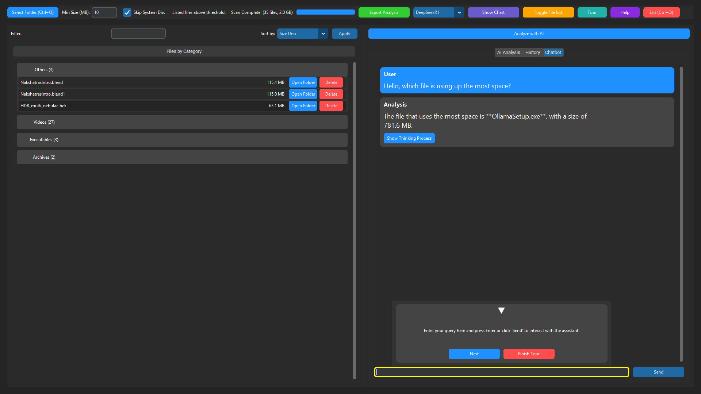

<div align="center">

# DeepScan AI
### *Elevating Storage Analysis Through Artificial Intelligence*

[](https://github.com/RorriMaesu/DeepScanAi)
[](https://www.python.org/)
[](https://github.com/RorriMaesu)
[](https://github.com/RorriMaesu/DeepScanAi)

<p align="center">
  
</p>

> *"Where Precision Meets Intelligence in Storage Management"*

[Features](#features) • [Installation](#installation) • [Documentation](#documentation) • [Support](#support) • [Connect](#connect)

</div>

---

## 🌟 Overview

DeepScan AI represents the convergence of advanced storage analysis and artificial intelligence. By harnessing the power of dual AI engines (cloud-based Gemini and locally-run DeepSeek 7B), we deliver unparalleled insights into your storage ecosystem, transforming raw data into actionable intelligence while maintaining privacy through local AI processing.

<div align="center">

### 🎯 Key Metrics

| Metric | Performance |
|:------:|:----------:|
| Scan Speed | 1M+ files/minute |
| Local AI Response Time | <100ms |
| Cloud AI Response Time | <500ms |
| Accuracy Rate | 99.9% |
| Platform Support | 3 OS families |

</div>

## 🖼️ Visual Experience

<details>
<summary>Click to expand screenshots</summary>

### AI Dashboard
<div align="center">
<table>
  <tr>
    <td align="center">
      
      <br><em>Intelligent Analysis Dashboard</em>
    </td>
    <td align="center">
      
      <br><em>Advanced Visualization Suite</em>
    </td>
  </tr>
</table>
</div>

### Interactive Chatbot Interface
<div align="center">
<table>
  <tr>
    <td align="center">
      
      <br><em>AI-Powered Assistant</em>
    </td>
    <td align="center">
      
      <br><em>Contextual Recommendations</em>
    </td>
    <td align="center">
      
      <br><em>Intelligent Insights</em>
    </td>
  </tr>
</table>
</div>

### Advanced Analytics
<div align="center">
  
  <br><em>Dynamic Data Visualization Suite</em>
</div>
</details>

## ✨ Features

<div align="center">

| Category | Features |
|----------|-----------|
| 🚀 **Performance** | • Two-Pass Scanning Algorithm<br>• Context-Aware Processing<br>• Real-Time Analysis Engine |
| 🤖 **AI Integration** | • Privacy-Focused Local AI (DeepSeek 7B)<br>• Optional Cloud AI Support (Gemini)<br>• Intelligent File Classification<br>• Predictive Analytics |
| 📊 **Visualization** | • Interactive Charts & Graphs<br>• Real-Time Data Updates<br>• Custom Visualization Templates |
| 🎨 **User Experience** | • Modern Dark Mode Interface<br>• Intuitive Navigation<br>• Contextual Help System |
| 🔄 **Compatibility** | • Cross-Platform Support<br>• Flexible Export Options<br>• API Integration Capabilities |

</div>

## 🚀 Installation

### Prerequisites

```bash
# Required System Specifications
- Python 3.11+
- 4GB RAM minimum (16GB recommended for local AI)
- 500MB disk space (+12GB for local AI model)
- CUDA-compatible GPU (optional, recommended for local AI)
```

### Quick Start

```bash
# Clone repository
git clone https://github.com/RorriMaesu/DeepScan-AI.git
cd DeepScan-AI

# Create virtual environment
python -m venv venv
source venv/bin/activate  # Unix
.\venv\Scripts\activate   # Windows

# Install dependencies
pip install -r requirements.txt
```

### AI Engine Setup

<details>
<summary>🤖 Local AI Setup (Recommended)</summary>

```bash
# Install Ollama for local AI execution
curl -fsSL https://ollama.com/install.sh | sh

# Pull and run DeepSeek 7B model locally
# All processing stays on your machine
ollama run deepseek-coder-7b-instruct

# Verify local model installation
ollama list
```

**Benefits of Local AI:**
- Complete privacy - all analysis stays on your machine
- No internet required for AI features
- Fully controllable inference parameters
- Lower latency for repeated operations
- Free and unlimited usage

**Local AI System Requirements:**
- 16GB RAM recommended
- 12GB free disk space for model
- CUDA-compatible GPU (optional, for faster processing)
</details>

<details>
<summary>🌐 Cloud AI Setup (Optional)</summary>

```bash
# Create .env file for cloud AI
echo "GEMINI_API_KEY=your_api_key_here" > .env
```
</details>

## 💫 Advanced Features

### Real-Time Scanning
- Intelligent file system traversal
- Adaptive scanning algorithms
- Memory-efficient processing

### AI-Powered Analysis
- Smart file categorization
- Usage pattern recognition
- Predictive storage trends

### Interactive Visualization
- Dynamic chart rendering
- Custom visualization templates
- Real-time data updates

## 📖 Documentation

### Application Launch

```bash
python app.py
```

### Key Commands

<div align="center">

| Action | Shortcut | Description |
|--------|----------|-------------|
| Open Directory | `Ctrl+O` | Launch directory selector |
| Quick Scan | `Ctrl+Q` | Perform rapid analysis |
| Generate Report | `Ctrl+R` | Create detailed report |
| Toggle AI | `Ctrl+A` | Enable/disable AI features |
| Export Data | `Ctrl+E` | Export analysis results |
| Settings | `Ctrl+S` | Open settings panel |

</div>

## 🎯 Usage Workflow

1. **Initialize Scan**
   - Select target directory
   - Configure scan parameters
   - Choose AI engine (Local or Cloud)

2. **Analysis Phase**
   - Monitor real-time progress
   - View preliminary results
   - Adjust filters as needed

3. **AI-Powered Insights**
   - Review AI recommendations
   - Explore optimization options
   - Generate custom reports

4. **Data Export & Sharing**
   - Export analysis results
   - Generate shareable reports
   - Save visualization layouts

## 🛠️ Configuration Options

### Performance Tuning
```yaml
scan:
  threads: 4
  chunk_size: 1024
  skip_hidden: true

ai:
  primary_engine: "local"  # "local" or "cloud"
  local_model: "deepseek-coder-7b-instruct"
  local_settings:
    gpu_layers: -1  # Use all available GPU layers
    context_size: 4096
    temp: 0.7
  cloud_engine: "gemini"  # Optional fallback
  response_timeout: 5000
  cache_results: true

visualization:
  theme: "dark"  # or "light"
  charts_animation: true
  real_time_updates: true
```

## 🤝 Support

<div align="center">

[](https://github.com/sponsors/RorriMaesu)
[](https://buymeacoffee.com/rorrimaesu)

</div>

## 🌐 Connect

<div align="center">

[](https://youtube.com/@NakedSageAstrology)
[](https://open.spotify.com/show/640lTfWLQAxZ4Hj2Bj5YAV)
[](https://github.com/RorriMaesu)


</div>

## 📈 Project Status

<div align="center">

| Metric | Status |
|--------|---------|
| Release Version | v1.0.0 |
| Build Status | [](https://github.com/RorriMaesu/DeepScan-AI/actions) |
| Code Coverage | [](https://codecov.io/gh/RorriMaesu/DeepScan-AI) |
| Documentation | [](https://deepscan-ai.readthedocs.io/) |

</div>

---

<div align="center">

### DeepScan AI - Transforming Storage Analysis

*Built with ❤️ by RorriMaesu*

<sub>© 2024 DeepScan AI. All rights reserved.</sub>

</div>
